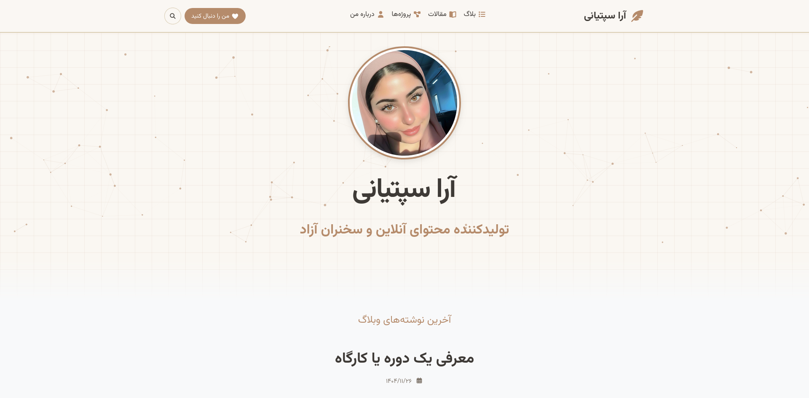

# پوسته آرا سپتیانی (Septiani) برای تایپ‌چو

<p align="center">
  
</p>

<p align="center">
  <a href="https://typecho.ir">
    
  </a>
  <a href="LICENSE">
    
  </a>
  <a href="https://github.com/abdulhalim/zara/releases">
    
  </a>
</p>

<div dir="rtl">

## معرفی

آرا سپتیانی یک پوسته مدرن، مینیمال و زیبا برای سیستم مدیریت محتوای تایپ‌چو است. این پوسته با تمرکز بر تجربه کاربری، خوانایی محتوا و طراحی چشمنواز توسعه یافته است.

## فهرست مطالب
- [ویژگی‌های اصلی](#ویژگی‌های-اصلی)
  - [طراحی بصری](#طراحی-بصری)
  - [واکنش‌گرایی](#واکنش‌گرایی-responsive)
  - [بخش‌های مختلف](#بخش‌های-مختلف)
  - [ویژگی‌های تعاملی](#ویژگی‌های-تعاملی)
  - [قابلیت‌های مدیریتی](#قابلیت‌های-مدیریتی)
- [راهنمای نصب](#راهنمای-نصب)
- [راهنمای تنظیمات](#راهنمای-تنظیمات)
  - [۱. تصاویر](#۱-تصاویر)
  - [۲. لوگو و آیکون‌ها](#۲-لوگو-و-آیکون‌ها)
  - [۳. اطلاعات نویسنده](#۳-اطلاعات-نویسنده)
  - [۵. منوی بالا](#۵-منوی-بالا)
  - [۶. شبکه‌های اجتماعی](#۶-شبکه‌های-اجتماعی)
  - [۷. دکمه CTA](#۷-دکمه-cta-call-to-action)
- [ساختار فایل‌ها](#ساختار-فایل‌ها)
- [قالب‌های سفارشی](#قالب‌های-سفارشی)
- [نکات مهم](#نکات-مهم)
- [سفارشی‌سازی پیشرفته](#سفارشی‌سازی-پیشرفته)
  - [متغیرهای CSS](#متغیرهای-css)
  - [افزودن شبکه‌های اجتماعی بیشتر](#افزودن-شبکه‌های-اجتماعی-بیشتر)
- [مرورگرهای پشتیبانی شده](#مرورگرهای-پشتیبانی-شده)
- [مجوز](#مجوز)
- [توسعه‌دهنده](#توسعه‌دهنده)

---

## ویژگی‌های اصلی

### 🎨 طراحی بصری
- **تم روشن با رنگ‌های گرم**: استفاده از پالت رنگی قهوه‌ای-طلایی در کنار کرم و بژ
- **پس‌زمینه شطرنجی ظریف**: ایجاد عمق بصری با الگوی خطوط ریز
- **تایپوگرافی خوانا**: با پشتیبانی از فونت وزیرمتن
- **حالت RTL کامل**: طراحی شده برای زبان‌های فارسی و عربی
- **انیمیشن‌های روان**: بدون ایجاد حس سنگینی

### 📱 واکنش‌گرایی (Responsive)
- طراحی کاملاً واکنش‌گرا برای تمام دستگاه‌ها
- منوی همبرگری (Hamburger Menu) در موبایل
- آف‌کانواس (Offcanvas) برای نمایش منو در موبایل
- بهینه‌سازی فاصله‌ها و اندازه‌ها در صفحه‌نمایش‌های کوچک

### 🧩 بخش‌های مختلف
- **صفحه اصلی**: نمایش لیست پست‌ها با طراحی مینیمال
- **صفحه پست**: نمایش محتوای کامل با لایت‌باکس تصاویر
- **صفحه ثابت**: برای ایجاد صفحات داخلی
- **صفحه آرشیو**: آرشیو دسته‌بندی‌ها، برچسب‌ها و نویسنده
- **صفحه نویسنده (رزومه)**: صفحه اختصاصی با قابلیت نمایش مهارت‌ها و تجربیات
- **سیستم نظرات**: طراحی زیبا با قابلیت پاسخگویی تا ۲ سطح

### ⚡ ویژگی‌های تعاملی
- **پنل جستجوی تمام‌صفحه**: با امکان جستجوی پیشرفته
- **دکمه بازگشت به بالا**: با افکت اسکرول نرم
- **لایت‌باکس تصاویر**: نمایش تصاویر در اندازه بزرگ با کلیک
- **افکت ذرات در هدر**: با قابلیت اتصال به حرکت موس
- **باکس نویسنده در پایین پست‌ها**: نمایش اطلاعات نویسنده

### 🛠 قابلیت‌های مدیریتی
- **تنظیمات گسترده در پنل مدیریت**: بیش از ۲۰ گزینه قابل تنظیم
- **فیلد سفارشی تصویر سربرگ**: برای پست‌ها و صفحات
- **آیکون‌های دلخواه برای دسته‌بندی و صفحات**: از طریق JSON
- **مدیریت منوی بالا**: انتخاب دسته‌بندی‌ها و صفحات دلخواه
- **شبکه‌های اجتماعی**: پشتیبانی از ۶ شبکه اجتماعی محبوب

---

## راهنمای نصب

1. فایل‌های پوسته را در مسیر `usr/themes/septiani` آپلود کنید.
2. از پنل مدیریت تایپ‌چو به بخش "ظاهر" بروید.
3. پوسته "آرا سپتیانی" را فعال کنید.

---

## راهنمای تنظیمات

پس از فعال‌سازی پوسته، می‌توانید از طریق منوی "تنظیمات پوسته" در پنل مدیریت، گزینه‌های زیر را پیکربندی کنید:

### ۱. تصاویر

| فیلد | توضیحات |
|------|---------|
| آدرس تصویر پروفایل | تصویری که در صفحه اصلی و باکس نویسنده نمایش داده می‌شود |
| آدرس تصویر نویسنده | تصویری که در صفحه رزومه نویسنده نمایش داده می‌شود |

### ۲. لوگو و آیکون‌ها

| فیلد | توضیحات |
|------|---------|
| کلاس آیکون کنار لوگو | آیکون FontAwesome (مثال: `fa-feather-alt`، `fa-pen`، `fa-star`) |
| آیکون‌های دسته‌بندی (JSON) | تخصیص آیکون به دسته‌بندی‌ها با فرمت `{"slug":"fa-class"}` |
| آیکون‌های صفحات (JSON) | تخصیص آیکون به صفحات با فرمت `{"slug":"fa-class"}` |

### ۳. اطلاعات نویسنده

| فیلد | توضیحات |
|------|---------|
| نام نویسنده | نامی که در صفحه نویسنده و باکس نویسنده نمایش داده می‌شود |
| بیوگرافی نویسنده | توضیحات کوتاه درباره نویسنده |
| شغل نویسنده | مثلاً "نویسنده و توسعه‌دهنده وب" |
| ایمیل نویسنده | برای نمایش در صفحه نویسنده |
| وب‌سایت نویسنده | آدرس وب‌سایت شخصی |
| شماره تماس | اختیاری |

### ۵. منوی بالا

با استفاده از گزینه‌های **"دسته‌بندی‌های منوی بالا"** و **"صفحات منوی بالا"** می‌توانید آیتم‌های دلخواه را برای نمایش در نوار بالایی انتخاب کنید.

### ۶. شبکه‌های اجتماعی

پشتیبانی از ۶ شبکه اجتماعی:
- اینستاگرام (`instagram`)
- توییتر (`twitter`)
- فیسبوک (`facebook`)
- یوتیوب (`youtube`)
- تلگرام (`telegram`)
- واتساپ (`whatsapp`)

برای هرکدام لینک پروفایل خود را وارد کنید.

### ۷. دکمه CTA (Call to Action)

| فیلد | توضیحات |
|------|---------|
| لینک دکمه CTA | آدرس صفحه یا لینک مورد نظر |
| متن دکمه CTA | متن نمایشی روی دکمه (پیش‌فرض: "من را دنبال کنید") |

---

## ساختار فایل‌ها

```
septiani/
├── css/
│   ├── style.css        # استایل‌های اصلی
│   ├── fonts.css        # فونت‌های آفلاین
│   └── all.css          # فونت‌آسوم (FontAwesome)
├── js/
│   ├── comments.js      # اسکریپت نظرات
│   └── particles.js     # افکت ذرات هدر
├── img/
│   ├── profile.jpg      # تصویر پیش‌فرض پروفایل
│   ├── author.jpg       # تصویر پیش‌فرض نویسنده
│   └── favicon.png      # آیکون سایت
├── functions.php        # توابع و تنظیمات پوسته
├── header.php           # هدر و منو
├── footer.php           # فوتر و اسکریپت‌ها
├── index.php            # صفحه اصلی
├── post.php             # صفحه پست
├── page.php             # صفحه ثابت
├── page-author.php      # صفحه نویسنده (قالب سفارشی)
├── archive.php          # صفحه آرشیو
├── comments.php         # سیستم نظرات
└── 404.php              # صفحه خطای ۴۰۴
```

---

## قالب‌های سفارشی

### صفحه نویسنده (page-author.php)
برای استفاده از این قالب، هنگام ایجاد صفحه جدید، از منوی "قالب صفحه" گزینه **"درباره من"** را انتخاب کنید.

---

## نکات مهم

1. **پشتیبانی از تاریخ شمسی**: در صورت نصب افزونه "جلالی"، تاریخ‌ها به صورت شمسی نمایش داده می‌شوند.
2. **فونت وزیرمتن**: فونت وزیرمتن به صورت آفلاین در پوسته قرار دارد.
3. **اعداد فارسی**: اعداد به صورت خودکار به فارسی تبدیل می‌شوند.
4. **تصاویر پیش‌فرض**: در صورت عدم تنظیم تصویر، از تصاویر پیش‌فرض داخل پوشه `img` استفاده می‌شود.

---

## سفارشی‌سازی پیشرفته

### متغیرهای CSS
برای تغییر رنگ‌های اصلی، می‌توانید متغیرهای `:root` در فایل `style.css` را ویرایش کنید:

```css
:root {
    --septiani-bg: #faf7f2;      /* رنگ پس‌زمینه */
    --septiani-text: #3e3a36;     /* رنگ متن */
    --septiani-accent: #b58b6b;   /* رنگ اصلی (سپتیانی) */
    --septiani-border: #d9cdb3;   /* رنگ حاشیه‌ها */
    --septiani-light-bg: #f5f0e8; /* پس‌زمینه روشن */
}
```

### افزودن شبکه‌های اجتماعی بیشتر
برای افزودن شبکه‌های اجتماعی جدید، باید در سه فایل `functions.php`، `header.php` و `footer.php` تغییرات لازم اعمال شود.

---

## مرورگرهای پشتیبانی شده

- گوگل کروم (نسخه ۶۰ به بالا)
- فایرفاکس (نسخه ۵۵ به بالا)
- سافاری (نسخه ۱۲ به بالا)
- اج (نسخه ۱۵ به بالا)
- اپرا (نسخه ۵۰ به بالا)

---

## مجوز

این پوسته تحت مجوز **GPLv3** منتشر شده است و استفاده و توسعه آن آزاد است.

---

## توسعه‌دهنده

- **نام**: Pourdaryaei
- **وب‌سایت**: [typecho.ir](https://typecho.ir)
- **نسخه**: ۱.۳

---

**آرا سپتیانی** - پوسته‌ای گرم و صمیمی برای وبلاگ شخصی شما ❤️

</div>
